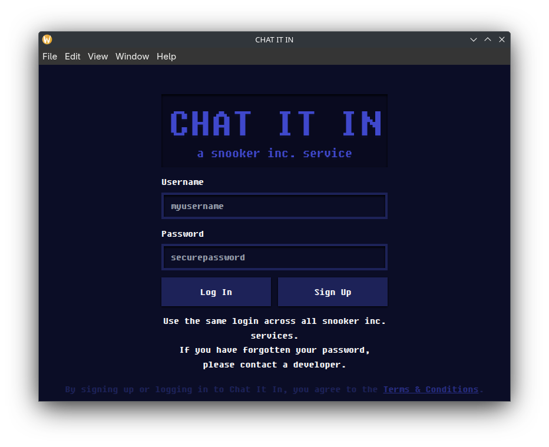
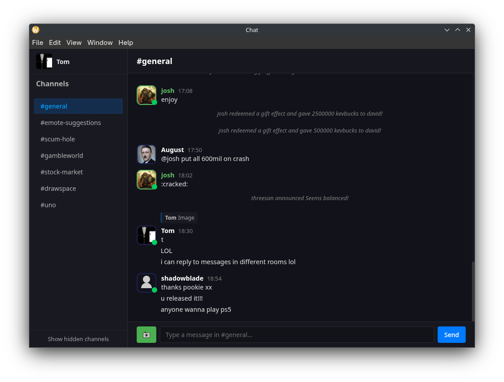
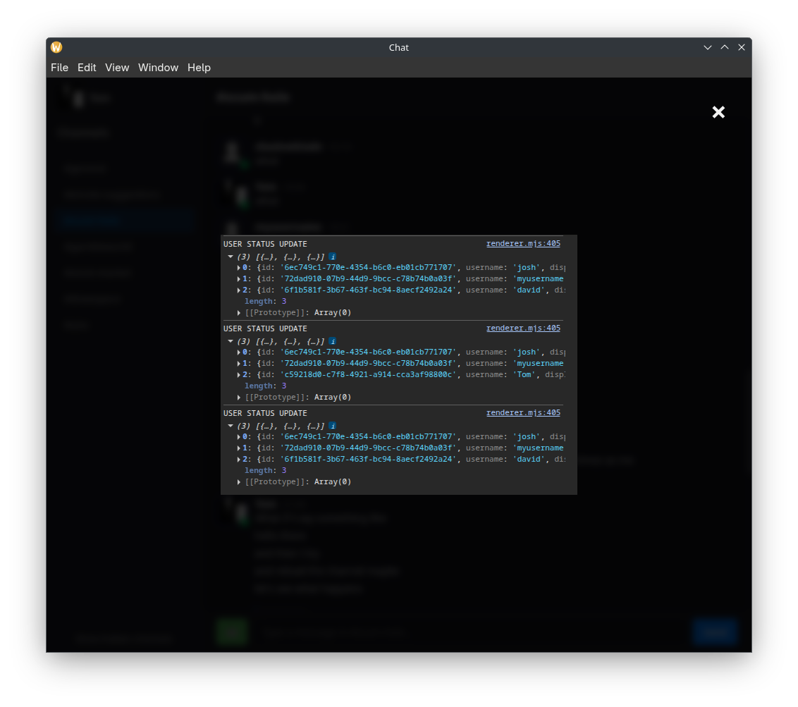

# Chat it out

A third-party desktop client for the [CHAT IT IN](https://www.chatitin.com) chat platform, built using Electron, with a clean and minimal vanilla JavaScript, HTML, and CSS frontend.

## Features

- Authentication (login from the official site)
- Switch between channels (rooms) at will
- Sending and receiving chat messages in real time
- Online status
- Upload and send images
- Reply to and delete messages

## Screenshots

_Login via the official site_


_Clean, familiar chat UI_


_Upload, send, receive and open images_


## Try it yourself!

Head to the latest [release](https://github.com/CreeperG16/chat-it-out/releases/latest) and download the bundled executable for your OS.

## Running from source

Prerequisites: [Node.js](https://nodejs.org/) and [Git](https://git-scm.com/)

```bash
git clone https://github.com/CreeperG16/chat-it-out.git
cd chat-it-out
npm install
````

### Running the App

```bash
npm start
```

This will launch the Electron app. On first run, you'll be prompted to log into CHAT IT IN.

## Reverse Engineering

This project was built by inspecting and mimicking the network behavior of the official CHAT IT IN web client. All HTTP endpoints and WebSocket messages were reverse engineered using browser dev tools.

Authentication is handled by opening the official login page in a separate window. Once the user logs in, the session cookie is intercepted and saved, and its token is used to authenticate further requests.
